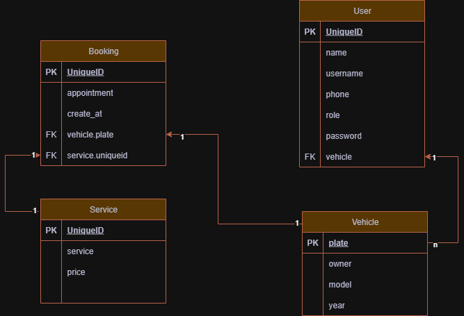
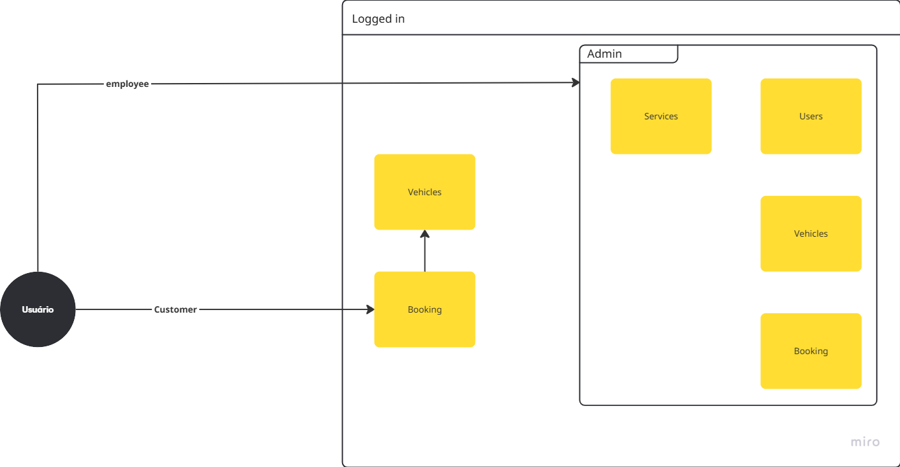
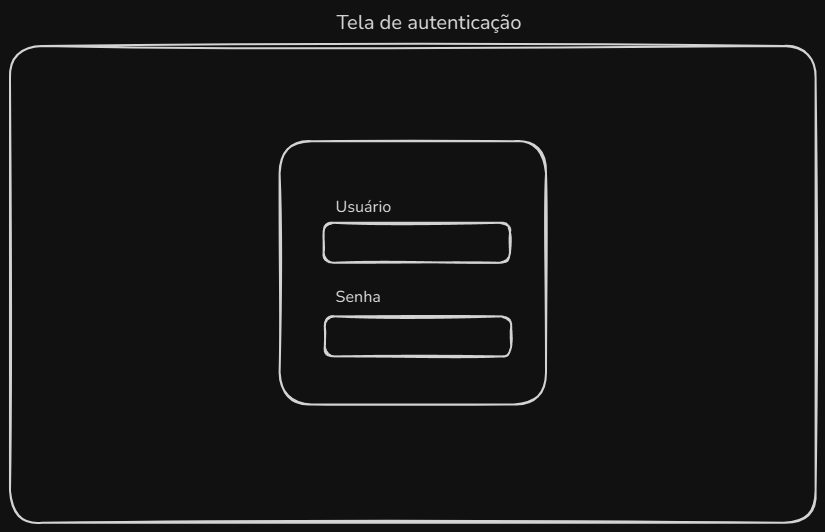
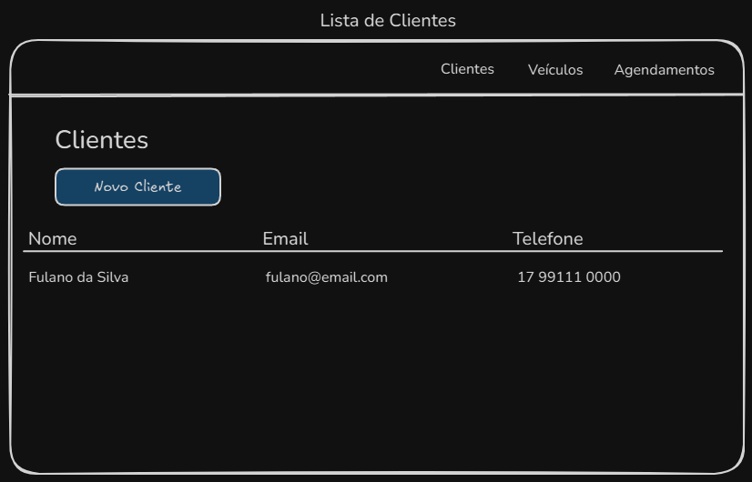
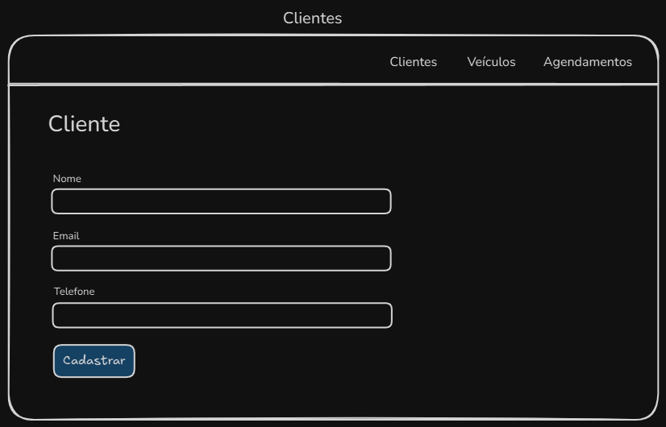
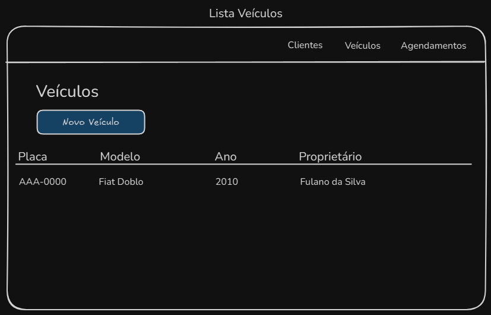
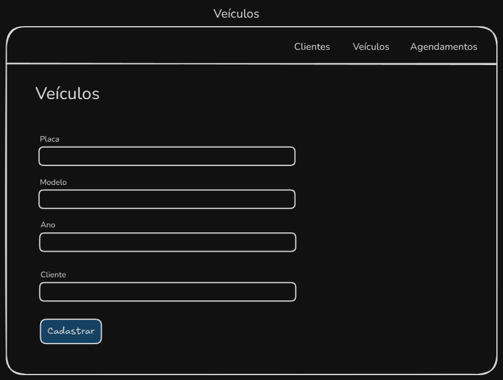
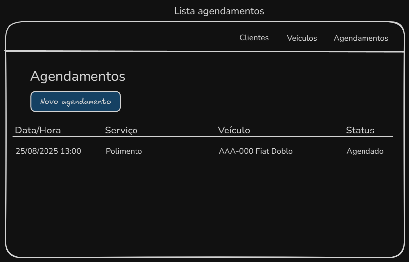
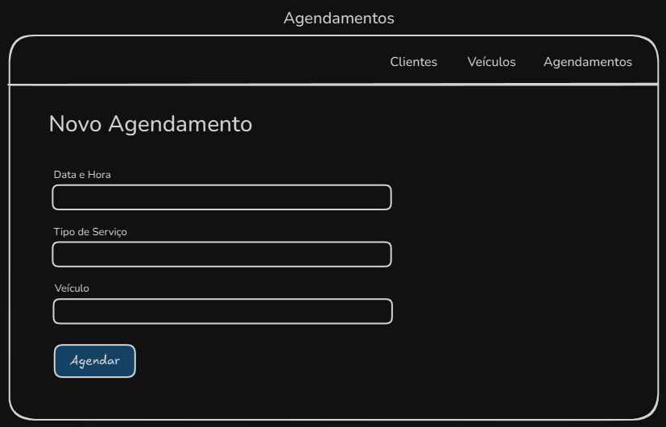

# CarWash System Architecture Documentation

## Overview

The Carwash system is a web-based application developed using Python/Flask, designed to manage car wash operations. This document outlines the system's architecture, including database design, user journey, and interface prototypes.

## System Architecture

### Technology Stack

- **Backend Framework**: Flask (Python)
- **Database**: SQLite with SQLAlchemy ORM
- **Frontend**: 
  - Jinja2 Templates
  - Tailwind CSS for styling
- **Authentication**: Flask-Login
- **Forms Handling**: WTForms

### Project Structure

```
carwash/
├── carwash/              # Core application package
│   ├── __init__.py      # App initialization and configuration
│   ├── forms.py         # Form definitions using WTForms
│   ├── models.py        # SQLAlchemy database models
│   ├── routes.py        # URL routes and view controllers
│   └── templates/       # Jinja2 HTML templates
├── instance/            # Instance-specific data (SQLite database)
├── docs/               # Documentation and assets
└── main.py            # Application entry point
```

## Database Design

The system uses a relational database with the following structure:



### Core Entities

1. **Users**
   - Manages user authentication and profiles
   - Stores personal information and role-based access

2. **Vehicles**
   - Links vehicles to their owners
   - Tracks vehicle details (plate, model, year)

3. **Services**
   - Defines available services
   - Maintains service pricing

4. **Bookings**
   - Connects users, vehicles, and services
   - Manages appointment scheduling

## User Journey

The application follows a user-centered design approach, with the following journey flow:



1. User Authentication
2. Vehicle Management
3. Service Selection
4. Booking Process
5. Appointment Management

## Interface Design

The system's interface was initially prototyped using low-fidelity wireframes to establish the basic user flow and functionality.

### Low-Fidelity Prototypes

1. **Login Page**<br>
   
   - User authentication interface
   - Login form with username/password
   - Link to registration

2. **User Management**<br>
   
   
   - User listing with search and filtering
   - User creation and editing forms
   - Role management

3. **Vehicle Management**<br>
   
   
   - Vehicle registration and management
   - Vehicle-owner association
   - Vehicle details and history

4. **Booking System**<br>
   
   
   - Appointment scheduling
   - Service selection
   - Time slot management

## Security Implementation

1. **Authentication**
   - Session-based authentication using Flask-Login
   - Password hashing with Bcrypt
   - Role-based access control

2. **Data Protection**
   - CSRF protection on forms
   - Input validation
   - Secure password handling

## Development Practices

1. **Code Organization**
   - MVC architectural pattern
   - Modular design
   - Separation of concerns

2. **Quality Assurance**
   - Flake8 as lint tool
   - Form validation
   - Error handling

## Future Enhancements

1. **Planned Features**
   - Email notifications for appointments
   - Service history tracking
   - Customer feedback system
   - Role-Based Access Control

2. **Technical Improvements**
   - API development for mobile integration
   - Performance optimization
   - Reporting features

## Deployment

The application is designed to be deployed in a production environment with:
- Gunicorn as WSGI server
- Nginx as reverse proxy
- SQLite for data persistence
- Environmental variable configuration

## Conclusion

The CarWash system architecture provides a solid foundation for managing car wash operations, with a focus on user experience, maintainability.